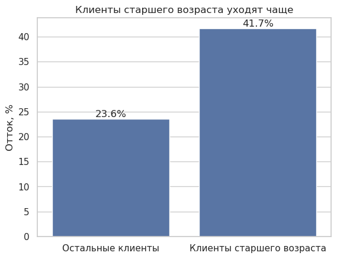
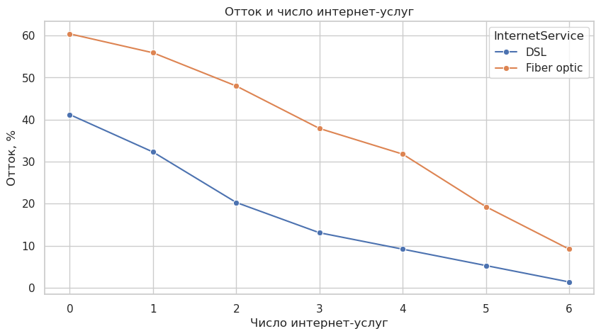
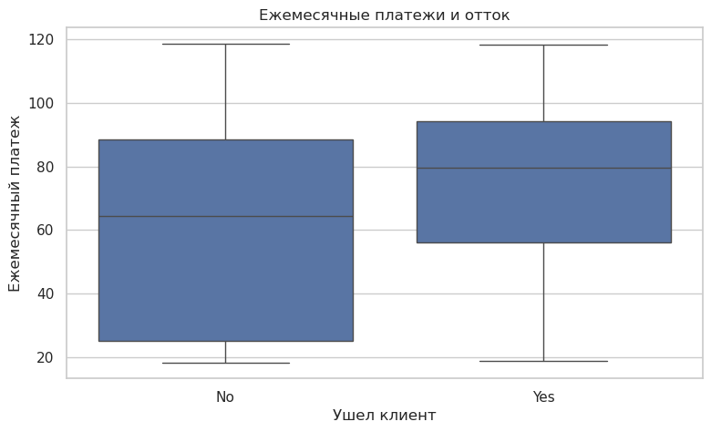

# Визуальный анализ оттока клиентов

Домашнее задание с онлайн курса Т-Образования - https://education.tbank.ru/school/basic/analysis/

Исследование оттока клиентов телеком-компании. С помощью простых графиков проект
показывает, какие группы клиентов уходят чаще и на кого команде удержания стоит
обратить внимание в первую очередь.

Это учебная работа по разведочному анализу, собранная на открытом telco-датасете.
В ноутбуке сравниваются возрастные группы, типы договоров, число подключенных
интернет-услуг и ежемесячные платежи. Использованы pandas, Matplotlib и Seaborn.

## Графики

Клиенты старшего возраста уходят чаще: 41,7% против 23,6% у остальных клиентов.

Отток в зависимости от числа интернет-услуг и типа подключения.

Распределение ежемесячных платежей у оставшихся и ушедших клиентов.

